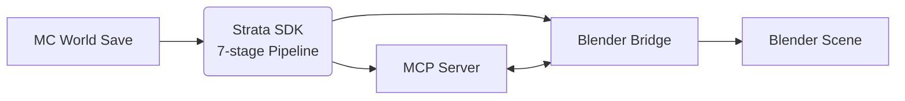
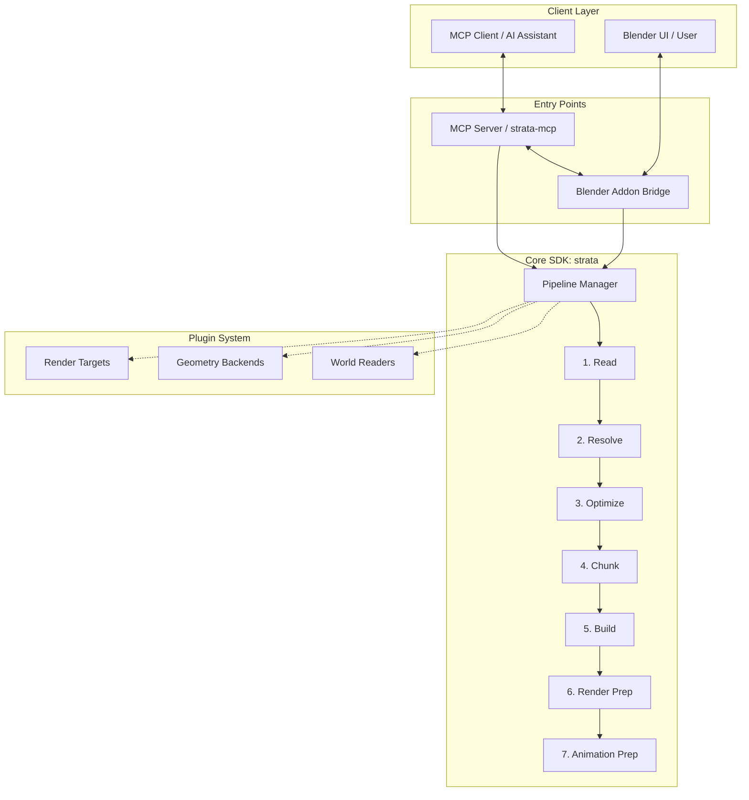

# Strata

**AI-native production pipeline for Blender.**

Strata is a professional, AI-native production pipeline designed specifically for Blender. It seamlessly translates massive, complex Minecraft worlds into optimized, render-ready cinematic scenes. By encapsulating deep production knowledge into a reusable software SDK, Strata eliminates repetitive scripts and prompts. The pipeline is fully integrated with a Model Context Protocol (MCP) server, allowing AI assistants to drive Blender directly, executing highly complex 3D workflows through natural language.

---

## Current Capabilities

Strata is currently focused on solving the first stage of a Minecraft production pipeline: reconstructing real Minecraft worlds inside Blender in a way that remains practical to edit. The current release imports world data, rebuilds it using the user's own block library, and organizes the result into chunked collections for efficient viewport workflows. The screenshots below demonstrate the current implementation rather than future goals.

### Individual Chunk

A reconstructed Minecraft chunk inside Blender. Every block remains a real Blender object or instance, allowing artists to inspect, select, edit, replace, or animate individual elements. This forms the smallest building block of the pipeline and demonstrates how Strata reconstructs Minecraft data into editable Blender geometry rather than a static mesh.

### Chunk Groups

Multiple chunks reconstructed together while preserving the same editable structure. As worlds become larger, chunk organization becomes increasingly important for viewport performance and scene management. Strata automatically generates chunk collections that make large environments significantly easier to navigate and edit inside Blender.

### Full World Reconstruction

A complete Minecraft world reconstructed inside Blender using the same pipeline. Even large environments retain the chunk organization established during import, allowing artists to work on manageable portions of the scene instead of a single monolithic world. This establishes the foundation upon which future production workflows can build.

### Procedural Blocky Clouds & Atmosphere

Procedural Minecraft-style blocky clouds and atmospheric environment system reconstructed inside Blender. The pipeline automatically generates 2km 3D blocky cloud layer footprints featuring micro-normal noise bump shaders, bevel edges, and vertical height-gradient color ramps—adaptable across daytime and nighttime sky lighting setups.

### Procedural Water Bodies

Production-quality water surfaces with mode-aware shading. The pipeline generates a procedural water mesh with a full Principled BSDF shader tree (Geometry Position → Noise Texture → Bump → Principled BSDF) that adapts between daytime and nighttime scenes. Daytime water uses brighter ocean turquoise tones with tight surface ripples, while nighttime water shifts to deep midnight navy with stronger moonlit bump contrast — all extracted from real production `.blend` files.

---

## What v0.4 Delivers

The current release is focused on establishing a robust, deterministic infrastructure for Minecraft imports and environment setup. It provides:

- **Minecraft world reconstruction**: Accurately parsing and interpreting `.mca` region files.
- **User block library population**: Dynamically mapping Minecraft block IDs to the user's custom Blender assets.
- **Chunk generation**: Grouping geometry into 16x16 chunk collections for high-performance viewport navigation.
- **Procedural cloud & environment generation**: Automatic 2km blocky cloud layers, atmospheric height fog, HDRI sky preservation, and visible sun mesh with independent directional lighting.
- **Procedural water bodies**: Mode-aware water surfaces (day/night) with production-tuned Principled BSDF shaders, noise-driven ripple normals, and adaptive coat/bump parameters extracted from real `.blend` production files.
- **Blender integration**: Custom add-on UI tools for hiding, showing, and managing chunks and environments on the fly.
- **SDK architecture**: A modular, 7-stage pure Python pipeline with environment extensions.
- **MCP integration**: Dedicated Model Context Protocol tools (`import_minecraft_world`, `generate_environment`) exposing the pipeline to AI agents.
- **Pipeline foundation**: A robust starting point for future advanced 3D workflows.

*(Note: Stylized character animation rigs, Unreal Engine USD exports, and procedural biomes belong to the roadmap and are planned for future versions.)*

---

## Architecture

The Strata architecture is designed with two distinct entry points, or "doors," that both leverage the same underlying logic. 

The first door is the **MCP Server (`strata-mcp`)**, designed for AI clients. It exposes pipeline capabilities as callable tools, allowing AI assistants to orchestrate scene creation. The second door is the **Blender Addon**, designed for human creators interacting directly with the Blender UI. 

Crucially, both doors feed directly into the unified **Strata SDK**. This core Python package manages the deterministic 7-stage pipeline. Because both interfaces use the exact same SDK, an AI can start a process via MCP, and a human can seamlessly continue editing the resulting scene in Blender, or vice versa. 

To make this bidirectional communication safe, Strata utilizes a socket-based **Bridge**. Since Blender's Python API is notoriously not thread-safe, the MCP server runs asynchronously and sends commands over a socket (port `:9877`). The Blender addon listens to this socket and safely executes incoming commands on Blender's main thread using a thread-safe queue managed by `bpy.app.timers`.

Finally, the SDK is highly extensible through its **Plugin System**. This abstraction allows developers to easily swap out major components: you can read from Anvil files or Litematica schematics, generate meshes via Geometry Nodes or barebones Python, and target rendering in EEVEE/Cycles or eventually Unreal Engine—all without altering the core pipeline logic.

---

## Quick Start

### For Creators
1. Download the latest `strata-addon.zip` release.
2. Open Blender 4.0+.
3. Navigate to `Edit` > `Preferences` > `Add-ons`.
4. Click `Install...`, select `strata-addon.zip`, and enable it.
5. In the 3D Viewport side panel (press `N`), locate the **Strata** tab.
6. Click **Start Bridge Server** to open the socket on port `:9877`.
7. Install the MCP server globally: `pip install strata-mcp`.
8. Configure your preferred AI assistant (e.g., Claude Desktop) to use the `strata-mcp` tool.
9. Ask your AI assistant to: "Import the Minecraft world located at `C:/path/to/saves/MyWorld`".
10. Watch as Strata builds the scene directly in your active Blender session!

### For Developers
1. Clone the repository: `git clone https://github.com/KaartikeyKusshwaha/Strata.git`
2. Navigate to the project root: `cd strata`
3. Create a virtual environment: `python -m venv venv`
4. Activate the virtual environment: `.\venv\Scripts\activate` (Windows) or `source venv/bin/activate` (Mac/Linux)
5. Install in editable mode with development dependencies: `pip install -e .[dev]`
6. Run the test suite to verify the installation: `pytest`
7. Explore the core pipeline logic in the `strata/` directory.
8. Check out [`CONTRIBUTING.md`](CONTRIBUTING.md) to learn how to write new plugins.

---

## User Instructions & Documentation Links

Everything you need is documented in detail across the `docs/` directory. Click the links below for your specific use case:

### 🎨 For Creators & Users (No Coding Required)
If you just want to use Strata to import Minecraft worlds into Blender, generate environment atmospheres, and render scenes:

- **[Installation & Setup Guide (`docs/SETUP.md`)](docs/SETUP.md)**: Detailed requirements, installing the Blender addon, directory structure, and configuring `strata-mcp` in Claude Desktop / Antigravity settings.
- **[Quickstart: Import Your First World (`docs/QUICKSTART.md`)](docs/QUICKSTART.md)**: 10-minute step-by-step guide to starting the bridge server, connecting the MCP server, passing your Minecraft save folder + chunk coordinates + self-made or web-downloaded block library `.blend` file, and rendering.
- **[Production Workflows (`docs/WORKFLOWS.md`)](docs/WORKFLOWS.md)**: Complete guide to generating day/night water bodies, blocky clouds, atmospheric height fog, sun/sky setups, managing 1000+ chunk worlds, and day-to-day viewport toggling.

### 🛠️ For Developers & Contributors
If you want to build plugins, extend pipeline stages, or contribute to the repository:

- **[Architecture Deep-Dive (`docs/ARCHITECTURE.md`)](docs/ARCHITECTURE.md)**: "Two doors, one pipeline" design, 7-stage SDK execution model, thread-safe socket bridge protocol (`:9877`), and plugin extension points.
- **[Project Roadmap (`docs/ROADMAP.md`)](docs/ROADMAP.md)**: Future milestones (Litematica schematics, Unreal USD exports, timeline animation).
- **[Contributing Guide (`CONTRIBUTING.md`)](CONTRIBUTING.md)**: Code style, PR guidelines, and running the `pytest` test suite.
- **[Project Manifesto (`VISION.md`)](VISION.md)**: The underlying philosophy behind turning production workflows into reusable software.

---

## Contributing
We welcome contributions from everyone! Whether it's adding a new render target, fixing a bug, or improving documentation, your help is appreciated. Please see our [`CONTRIBUTING.md`](CONTRIBUTING.md) for details on how to get started, our code of conduct, and the pull request process.

## License
Strata is released under the [GNU General Public License v3.0](LICENSE). See [NOTICE](NOTICE) for authorship details.

